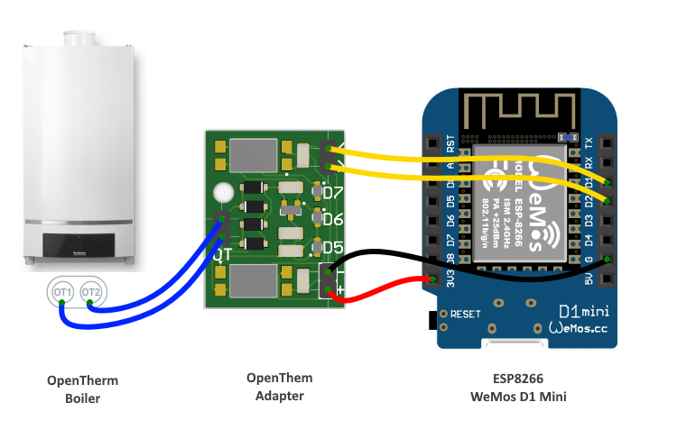

# OpenTherm protocol implementation for NodeMCU
The implementation of OpenTherm communication protocol for ESP8266 with [NodeMCU firmware](https://nodemcu.readthedocs.io). Written on LUA language. 

It was inspired by [@Ihor Melnik](https://github.com/ihormelnyk) [OpenTherm Adapter](http://ihormelnyk.com/opentherm_adapter) and [Arduino Library](https://github.com/ihormelnyk/opentherm_library) implementation.

OpenTherm Library is based on [OpenTherm protocol specification v2.2](http://ihormelnyk.com/Content/Pages/opentherm_library/Opentherm%20Protocol%20v2-2.pdf) and works with all OpenTherm compatible boilers. Library can be easily installed into ESP8266 based controllers based on NodeMCU firmware.

OpenTherm protocol requires simple low voltage two wire connection to boiler, but voltage levels (7..15V) still much higher than ESP8266 levels, which requires [OpenTherm Adapter](http://ihormelnyk.com/opentherm_adapter).

This library uses interrupts to achieve better stability and synchronization with boiler. Also it written in LUA language which makes the API very usefull and rich.

 ## Using OpenTherm Library you will be able
 - control your boiler remotely (get status, switch on/off heating/water heating, set water temperature and much more)
 - make custom thermostat
 
 ## Hardware Connection
 You have to choose 2 controller GPIO pins which will be used for communication and connected to OpenTherm Adapter. Controller ESP8266 input pin should support interrupts. Controller output pin should be connected to OpenTherm Adapter input pin and vise versa.
 
 
 
 On image you can see than output pin D1 of the controller is connected to the input pin of Adapter. And input pin D2 of the controller is connected to output pin of Adapter
 
 # OpenTherm Library Usage 
 First of all you need to [upload library into ESP](#Upload Library into ESP8266 with NodeMCU). Then in you code include 
 
 ```lua
 local ot = require "openThermLibrary"
 ```
 You have to choose 2 controller GPIO pins which will be used for communication and connected to [OpenTherm Adapter](http://ihormelnyk.com/opentherm_adapter). 
 
 ```lua
  ot.begin(2, 1) -- pinIn - D2, pinOut - D1
  ```
  
  After that you are free to make any requests to the Boiler
  
 ```lua
   print("response => ", ot.getBoilerStatus())
``` 

## API Description

## Upload Library into ESP8266 with NodeMCU
